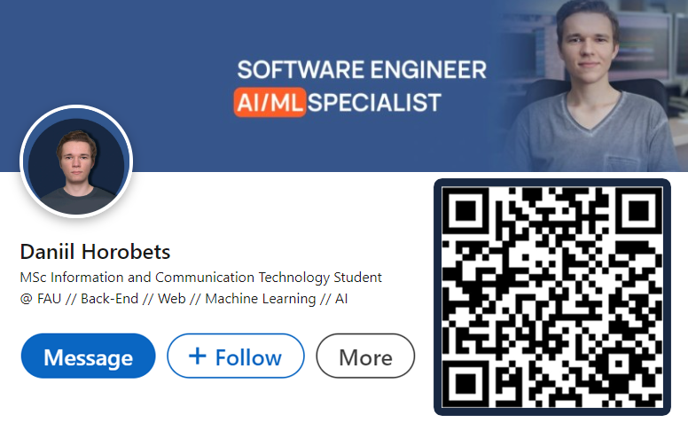

# Hi there, I'm Daniil! 👋

## About Me 🚀

I'm a passionate **Software Engineer** with experience in **AI/ML**. I love tackling complex problems, learning new skills, and collaborating with diverse teams to create innovative solutions.

- 🎓 Currently pursing MSc in **Information and Communication Technology at [FAU](https://www.fau.eu/)**
- 🌍 Languages: **Java, Python, R, VHDL, C++**
- 🛠️ Frameworks: **Spring, PyTorch**
- 🗄️ Databeses: **MySQL, PostgreSQL**
- 🧰 Tools and Technologies: **Git, Docker, Linux, Swagger, Postman, Maven, JPA, Hibernate, NumPy, Pandas**

## Get in Touch via [LinkedIn](https://www.linkedin.com/in/daniil-horobets/) 📬

  

