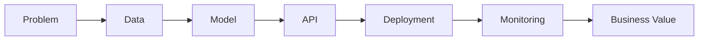

              
<h1 align="center">Daniil Horobets</h1>
<h3 align="center">AI/ML Expert</h3>

  

  I build production AI systems from problem understanding and model design
  to deployment, monitoring, and business use.

  
  
  

  
  

---

## Quick Snapshot

<table>
<tr>
<td width="50%" valign="top">

### What I build
- LLM applications and AI assistants  
- RAG pipelines and multilingual NLP systems  
- Computer vision and real-time perception systems  
- Forecasting, anomaly detection, and edge AI solutions  

</td>
<td width="50%" valign="top">

### What I usually own
- AI solution architecture  
- Model lifecycle and MLOps  
- Cloud deployment and platform integration  
- Technical leadership and stakeholder communication  

</td>
</tr>
</table>

## AI Delivery Lifecycle

```mermaid
flowchart LR
    A[Problem] --> B[Data]
    B --> C[Model]
    C --> D[API]
    D --> E[Deployment]
    E --> F[Monitoring]
    F --> G[Business Value]
```

---

## How I Work

<table>
<tr>
<td width="50%" valign="top">
  <b>Production AI</b> 
  I turn ML ideas into systems that teams can ship and scale.
</td>
<td width="50%" valign="top">
  <b>Architecture Thinking</b> 
  I connect models, APIs, and infrastructure into one solution.
</td>
</tr>
<tr>
<td width="50%" valign="top">
  <b>MLOps & Cloud</b> 
  I design deployment, tracking, orchestration, CI/CD, and monitoring as part of the product.
</td>
<td width="50%" valign="top">
  <b>Leadership</b> 
  I lead technical decisions, explain trade-offs clearly, and help teams move faster with less risk.
</td>
</tr>
</table>

---

## Tech Stack

  

  
  
  
  
  
  

---

## Featured Projects

### [MyInterior-AI](https://github.com/Daniil-Horobets/MyInterior-AI)
Generative AI for interior design from sketch images to photorealistic room concepts.  
**FastAPI · React · Stable Diffusion · ControlNet · Docker**

### [One-vs-All-Image-Classifier](https://github.com/Daniil-Horobets/One-vs-All-Image-Classifier)
Deep learning classifier for solar cell defect detection.  
**PyTorch · Image Classification · Binary Relevance · F1-focused evaluation**

### [Project SENSATION](https://lme.tf.fau.de/thesis/project-sensation-sidewalk-environment-detection-system-for-assistive-navigation/)
Assistive navigation project related to sidewalk understanding and environmental perception.  
**Computer Vision · Segmentation · Detection · Accessibility**

---

## Education

- **Artificial Intelligence Graduate Certificate** — Stanford University  
- **M.Sc. in Information and Communication Technology** — FAU Erlangen-Nürnberg  
- **B.Sc. in Infocommunication Technologies**

---

## Recognition

- **1st Place** — The Tensor Tournament Hackathon  
- **1st Place** — FAU Deep Learning Challenge  
- Certifications in **Azure AI**, **Docker**, **Vector Databases**, and **Data Science**

---

## Connect With Me

  
  

